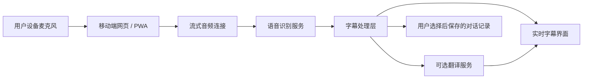

# 初步核心方案

版本：0.1  
日期：2026-06-27  
项目：Grandpa's New Ears / 爷爷的新耳朵

## 1. 一句话定位

一款让听障人士在自己的设备上实时看到他人话语的字幕与翻译应用。

## 2. 首个核心承诺

当身边的人说话时，用户不需要对方安装任何东西，只要打开自己的设备，就能看到足够快、足够清楚、足够舒服的文字。

## 3. 推荐 MVP 形态

先做「手机优先的网页应用 / PWA」，而不是一开始同时开发 iOS、Android 和桌面端。

原因：

- 可以最快验证真实使用场景。
- 用户通过链接即可打开，试用门槛低。
- 适合先打磨字幕体验、延迟、字号、对比度和翻译流程。
- 后续如果证明需求明确，再沉淀为原生 App。

## 4. MVP 核心流程

1. 用户打开应用。
2. 点击「开始」。
3. 授权麦克风。
4. 对方说话。
5. 屏幕实时显示大字号字幕。
6. 如果开启翻译，字幕下方显示译文。
7. 结束对话时，用户选择保存或不保存。

## 5. 第一版必须做到的事

- 一键开始实时字幕。
- 字幕足够大，适合老人和低视力用户阅读。
- 识别过程中先显示临时字幕，识别完成后固定为正式字幕。
- 支持手动选择讲话语言。
- 支持可选翻译。
- 支持大字号和高对比度模式。
- 明确展示「正在听」「已暂停」「网络异常」「麦克风未授权」状态。
- 默认不保存对话，除非用户主动选择保存。

## 6. 第一版暂时不做的事

- 不承诺替代助听器。
- 不承诺医疗、法律级准确率。
- 不优先做电话通话字幕，因为不同系统限制较多。
- 不优先做复杂会议纪要。
- 不优先做多人声纹注册。
- 不做社交分享。

## 7. 产品体验原则

- 字幕屏就是主界面，不做复杂首页。
- 控件少，状态清楚，字号优先。
- 默认保护隐私，保存前必须让用户知道。
- 先解决「看得见、跟得上、敢使用」，再解决更高级的智能功能。
- 所有错误都要用普通人能理解的话表达。

## 8. 技术方向

初期建议架构：

- 前端：移动端网页 / PWA，负责麦克风采集、字幕展示、设置和历史记录。
- 传输：使用流式连接把音频片段发送到后端。
- 后端：作为语音识别、翻译、会话管理和隐私策略的网关。
- 识别服务：通过短期技术验证选择流式语音识别方案。
- 翻译服务：作为可替换模块接入。
- 存储：只保存用户明确选择保存的对话。

## 9. 首轮验证重点

- 用户能否在 2 次点击内开始看到字幕。
- 临时字幕是否足够快。
- 大字号是否真的舒服。
- 老人能否独立完成麦克风授权。
- 云端识别是否能被用户接受。
- 嘈杂环境下是否仍有基本可用性。
- 翻译是并排显示更好，还是只显示译文更好。

## 10. 下一步建议

1. 用 PRD 固定 MVP 边界。
2. 做一个低保真交互原型。
3. 找 5 到 8 位听障人士、老人或照护者访谈。
4. 做语音识别技术验证。
5. 进入第一版可用原型开发。

