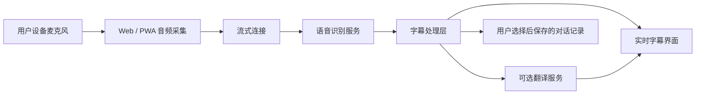

# Grandpa's New Ears 产品需求文档

版本：0.1  
日期：2026-06-27  
状态：初始产品底稿

## 1. 产品概述

Grandpa's New Ears，中文工作名「爷爷的新耳朵」，是一款面向听障人士、听力下降老人及其家人的实时字幕与翻译应用。它帮助用户在自己的手机、平板或电脑上看到身边人的话语，并用适合听障与老人群体的方式呈现：大字号、高对比、少干扰、低学习成本。

第一版要证明一个核心价值：

> 当别人面对面说话时，用户可以快速、舒服、可信地把对话看成文字。

## 2. 背景与问题

听障人士和听力下降老人经常在日常对话中遇到困难，例如家庭聚餐、医院问诊、药店买药、银行柜台、出租车沟通、社区活动和小型会议。现有方案往往存在这些问题：

- 操作复杂，老人难以独立使用。
- 字幕太小，阅读压力大。
- 实时性不足，跟不上自然对话。
- 隐私说明不清楚，用户不知道录音和文字会不会被保存。
- 翻译、说话人提示、历史记录等能力分散或不好用。
- 需要对方配合安装应用，降低真实场景可用性。

## 3. 产品目标

- 让用户在 2 次点击内开始实时字幕。
- 在说话尚未结束时显示临时字幕，降低等待感。
- 为老人和低视力用户提供舒适的大字号阅读体验。
- 支持跨语言沟通中的可选翻译。
- 默认保护隐私，不主动保存对话。
- 为后续离线识别、会议模式、照护者辅助等能力打下基础。

## 4. MVP 非目标

- 不替代医疗助听器。
- 不承诺医疗、法律、合同场景的专业准确率。
- 不优先支持所有系统上的电话通话字幕。
- 不做复杂会议纪要和项目协作。
- 不做社交网络或公开分享功能。
- 不要求每位说话人预先注册声纹。

## 5. 目标用户

### 主要用户

- 有听力损失的老人。
- 需要面对面实时字幕的听障人士。

### 次要用户

- 家人、照护者和朋友。
- 医生、药师、窗口服务人员、社区工作人员。
- 需要跨语言沟通的家庭和服务场景。

## 6. 核心使用场景

### UC1：家庭对话

用户在家庭聚餐时打开应用，点击开始，把手机放在桌上，实时看到家人的话。

### UC2：医院问诊

用户在看医生前打开字幕，医生讲话时用户能看见重点内容。结束后，用户可以选择保存本次记录，方便回看用药说明。

### UC3：窗口服务

用户在银行、药店、商店或政务窗口使用应用。应用需要启动快、文字大、状态清楚，并且让用户知道是否保存内容。

### UC4：跨语言沟通

对方说一种语言，用户看到原文字幕和译文。用户可以选择只看译文，也可以同时看原文和译文。

## 7. MVP 范围

### P0：必须有

- 一键开始实时收音。
- 实时语音转文字。
- 面向阅读的大字号字幕界面。
- 正在听、暂停、重连、出错等明确状态。
- 手动选择讲话语言。
- 可选翻译输出。
- 字号调节。
- 高对比度模式。
- 对话保存开关，默认关闭。
- 仅保存用户明确选择保存的对话。
- 首次使用时给出清楚的隐私说明。

### P1：应该有

- 自动识别讲话语言。
- 基础说话人变化提示，例如「说话人 1」「说话人 2」。
- 复制字幕和简单纠错。
- 对保存的对话生成简短摘要。
- 自定义词表，例如姓名、药品名、地址、家庭称呼。
- 初步评估离线或半离线能力。

### P2：后续扩展

- 原生 iOS 和 Android 应用。
- 可穿戴设备显示。
- 会议模式，通过二维码让更多人加入。
- 照护者远程协助设置。
- 常用紧急短语卡片。
- 与系统无障碍设置集成。
- 隐私敏感场景下的端侧识别。

## 8. 用户体验要求

### 首次启动

- 用一屏说明应用用途。
- 引导用户授权麦克风。
- 询问是否保存字幕，默认不保存。
- 让用户选择讲话语言和可选翻译语言。

### 实时字幕屏

- 主界面就是字幕，不做复杂仪表盘。
- 开始、暂停、结束按钮必须显眼。
- 说话过程中先显示临时字幕。
- 识别完成后将内容固定为正式字幕。
- 字幕在手臂距离外仍可阅读。
- 正在听时避免出现太多控件。

### 字幕呈现

- 最新字幕优先出现在容易阅读的位置。
- 长句自然换行。
- 临时字幕和正式字幕有轻微视觉区分。
- 开启翻译时，译文可以显示在原文下方。
- 用户可以切换普通、大、超大字号。

### 历史记录

- 仅用户主动保存的对话进入历史记录。
- 历史记录展示日期、时长、语言、原文、译文和可选摘要。
- 用户可以删除任何已保存记录。

## 9. 功能需求

| 编号 | 需求 | 优先级 |
| --- | --- | --- |
| FR-001 | 用户可以从主界面开始实时字幕。 | P0 |
| FR-002 | 应用在明确授权后采集麦克风音频。 | P0 |
| FR-003 | 应用可以流式发送音频并显示临时识别结果。 | P0 |
| FR-004 | 应用按时间顺序显示正式字幕片段。 | P0 |
| FR-005 | 用户可以暂停和继续收音。 | P0 |
| FR-006 | 用户可以结束本次对话。 | P0 |
| FR-007 | 用户可以手动选择讲话语言。 | P0 |
| FR-008 | 用户可以开启翻译并选择目标语言。 | P0 |
| FR-009 | 用户可以调节字幕字号。 | P0 |
| FR-010 | 用户可以开启高对比度模式。 | P0 |
| FR-011 | 除非用户主动选择，应用不保存字幕。 | P0 |
| FR-012 | 用户可以查看已保存对话。 | P0 |
| FR-013 | 用户可以删除已保存对话。 | P0 |
| FR-014 | 麦克风拒绝、网络中断、识别失败时，应用显示清楚错误。 | P0 |
| FR-015 | 应用可以为保存的对话生成简短摘要。 | P1 |
| FR-016 | 用户可以添加自定义词表。 | P1 |
| FR-017 | 支持时，应用可以提示说话人变化。 | P1 |

## 10. 无障碍要求

- 实时字幕默认使用大字号。
- 超大字号下布局不能破裂。
- 文本和背景保持高对比度。
- 状态不能只靠颜色表达。
- 控件需要支持屏幕阅读器。
- 主要操作在手机上应适合单手触达。
- 避免闪烁、过度动效和干扰性动画。
- 对无法依赖声音反馈的用户，必须提供清楚的视觉状态。

## 11. 非功能需求

### 延迟

- 临时字幕目标：从说话到可见文字低于 1.5 秒。
- 正式字幕目标：一句话结束后 3 秒内稳定。

### 准确率

- MVP 优先保证大意可理解，而不是标点完美。
- 需要在安静房间、家庭饭桌、诊室、服务窗口等环境中测试。

### 稳定性

- 网络短暂中断时应尝试恢复。
- 重连期间保留已显示字幕。
- 如果用户选择保存，对话意外结束时尽量不丢失已确认内容。

### 隐私

- 只有用户明确点击开始后才使用麦克风。
- 默认不保存字幕。
- 保存内容可删除。
- 隐私设置必须清楚可见。
- 文案不能暗示医疗级准确率。

## 12. 推荐技术方案

### MVP 平台

建议先做移动端网页 / PWA。这样能最快让真实用户试用，不必等待应用商店发布。验证核心价值后，再决定是否开发原生 App。

### 高层架构

### 前端

- 移动优先响应式界面。
- 实时字幕渲染。
- 麦克风授权与音频采集。
- WebSocket 或其他流式传输方式。
- 本地设置：语言、字号、对比度、是否保存。

### 后端

- 流式语音识别网关。
- 翻译服务适配层。
- 会话与字幕记录接口。
- 隐私控制和数据保留规则。
- 延迟、失败率和稳定性监控。

### 语音识别与翻译

需要通过短期技术验证选择具体服务。评估维度：

- 是否支持流式临时结果。
- 日常噪声环境准确率。
- 延迟。
- 每小时成本。
- 支持语言。
- 翻译质量。
- 数据保留与隐私条款。
- 后续是否能支持端侧或混合模式。

## 13. 数据模型草案

### UserSettings

- `captionLanguage`
- `translationEnabled`
- `translationLanguage`
- `fontScale`
- `contrastMode`
- `saveTranscriptsByDefault`
- `customVocabulary`

### ConversationSession

- `id`
- `startedAt`
- `endedAt`
- `sourceLanguage`
- `targetLanguage`
- `saveEnabled`
- `status`

### TranscriptSegment

- `id`
- `sessionId`
- `startedAt`
- `endedAt`
- `speakerLabel`
- `text`
- `translatedText`
- `isFinal`
- `confidence`

## 14. 成功指标

- 从打开应用到看到第一条字幕的时间。
- 临时字幕延迟中位数。
- 用户对字幕可读性的评分。
- 用户成功开始首个会话的比例。
- 会话完成率。
- 用户主动保存字幕的比例。
- 试点用户周活跃情况。
- 听障用户与照护者的定性反馈。

## 15. 用户研究问题

- 最新字幕放在底部、中间还是顶部更适合阅读？
- 翻译应该和原文并排显示，还是只显示译文？
- 老人能接受多少首次设置步骤？
- 哪些场景最容易导致识别失败？
- 在默认不保存的前提下，云端识别是否能被用户接受？
- 默认字号和对比度应该是多少？

## 16. 主要风险

- 嘈杂环境下识别效果可能不稳定。
- 云端语音识别可能带来隐私顾虑。
- 不同浏览器和系统的麦克风能力有差异。
- 实时翻译可能增加延迟或产生语义偏差。
- 老人可能被系统权限弹窗卡住。
- 电话通话字幕存在系统限制，不应作为 MVP 前提。

## 17. 里程碑

### M0：产品基础

- 固化 PRD。
- 做可点击原型。
- 访谈 5 到 8 位目标用户或照护者。
- 确定 MVP 技术栈。

### M1：实时字幕原型

- 麦克风采集。
- 流式语音识别。
- 实时字幕界面。
- 错误与重连状态。

### M2：无障碍 MVP

- 字号控制。
- 高对比度模式。
- 手动语言选择。
- 可选翻译。
- 保存或丢弃对话流程。

### M3：试点

- 与目标用户进行试用。
- 测量延迟、可读性和成功启动率。
- 改进噪声环境体验。
- 决定是否进入原生 App 和离线能力开发。

## 18. 待决策事项

- 最终产品名与中文名。
- 只做 Web/PWA，还是第一阶段就做原生 App。
- 语音识别服务选择。
- 翻译服务选择。
- 保存历史是否需要登录账号。
- 首批支持语言。
- GitHub 仓库公开还是私有。

